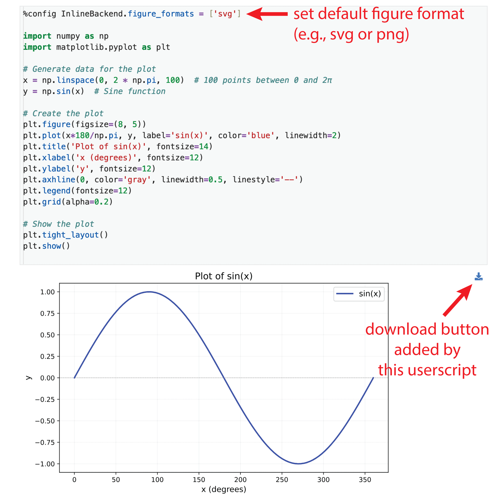

# JupyterLab Image Downloader for SVG and common image formats

A userscript to add a **download button** to images and SVGs rendered in JupyterLab notebooks. This script supports both `.svg` and common image formats like `.png` and `.jpeg`. The download buttons appear in the top-right corner of the rendered output, allowing you to save the plot with a single click.

## Features

- Automatically detects and adds a download button to:
  - SVG graphics rendered in `.jp-RenderedSVG` elements.
  - Images rendered in `.jp-RenderedImage` elements (e.g., `.png`, `.jpeg`).
- Dynamically supports new images added during notebook execution.
- Downloads files in their original format with the correct extension (e.g., `.svg`, `.png`).
- Works with both `http` and `https` JupyterLab domains.

## Screenshot



## Installation

1. **Install a Userscript Manager**:
   - For Chome, Firefox, Edge, use the recommended [Violentmonkey](https://violentmonkey.github.io/).
   - Alternatively, use [Tampermonkey](https://www.tampermonkey.net/) or [Greasemonkey](https://addons.mozilla.org/en-US/firefox/addon/greasemonkey/) and any other compatible Userscript manager.

2. **Install the Script**:
   - Copy the code from [JupyterLab Image Downloader](./your-script-url.js) and create a new userscript in your script manager.
   - Alternatively, click the raw link in your repository to install directly (if hosted).

3. **Reload JupyterLab**:
   - The script will automatically work on both `http` and `https` JupyterLab domains.

## Usage

1. Open your JupyterLab notebook.
2. Execute a cell that generates an image or SVG plot.
3. A **download button** (with a Font Awesome icon) will appear in the top-right corner of the rendered output.
4. Click the button to save the plot or image in the appropriate format.

## Example Output

The button appears in the top-right corner of any supported element:

```
<div class="jp-RenderedImage" data-mime-type="image/png">
    
    <button class="download-image-button"><i class="fas fa-download"></i></button>
</div>
```

## Development

To modify or extend the script:

1. Clone the repository:
   ```bash
   git clone https://github.com/your-username/jupyterlab-image-downloader.git
   cd jupyterlab-image-downloader
   ```

2. Edit the userscript (`jupyterlab-image-downloader.js`) as needed.

3. Test the changes by pasting the script into your userscript manager.

## License

This project is licensed under the MIT License. See the [LICENSE](./LICENSE) file for details.

## Author
- **Author:** Andrea Alberti
- **GitHub Profile:** [alberti42](https://github.com/alberti42)
- **Donations:** [](https://buymeacoffee.com/alberti)

Feel free to contribute to the development of this plugin or report any issues in the [GitHub repository](https://github.com/alberti42/sublime-virtualenv/issues).
